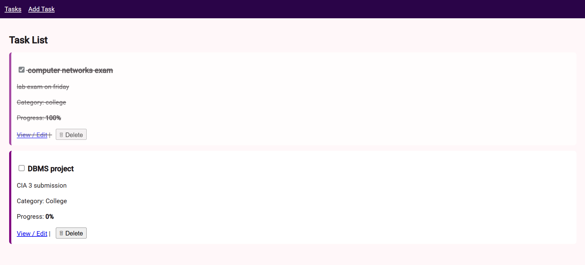
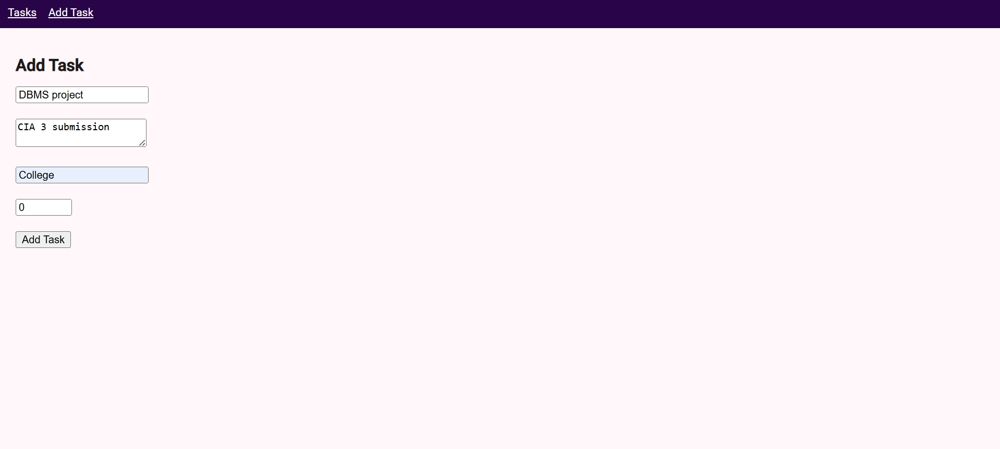

# 🗂️ Task Management and Productivity Tracker

A simple and interactive **Task Management and Productivity Tracker** web application built using **Angular** and **TypeScript**.
This project simulates a real-world productivity tool where users can create, update, categorize, track, complete, and delete tasks with dynamic UI updates.

---

### Task List View



### Add Task View



## Tech Stack

* **Frontend:** Angular (Standalone Components)
* **Language:** TypeScript
* **Styling:** CSS
* **Storage:** Browser Local Storage
* **Version Control:** Git & GitHub

---

## ⚙️ How to Run the Project

1. Clone the repository:

   ```bash
   git clone https://github.com/<your-username>/Restaurant-Menu-Ordering-System.git
   ```

2. Navigate into the project folder:

   ```bash
   cd Restaurant-Menu-Ordering-System
   ```

3. Install dependencies:

   ```bash
   npm install
   ```

4. Run the development server:

   ```bash
   ng serve
   ```

5. Open your browser and visit:

   ```
   http://localhost:4200
   ```
